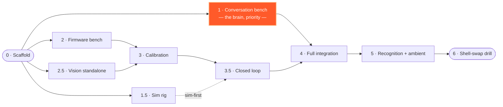

# NPC — Nomadic. Personal. Companion.

A convention face-tracking robot. Pan/tilt robot head: tracks + recognizes
people (OpenCV, Jetson Orin Nano Super 8GB), converses via fully local LLM
(llama.cpp, Llama-3.2-3B), servo motion smoothed on an ESP32-S3
(MicroPython). Swappable 3D-printed shells via per-shell calibration
profiles. Full digital twin in `/sim`.

**[Meet the eye &rarr;](https://dlux2015.github.io/NPC/)** — its actual display
renderer, ported to your browser. Follows your cursor.

Licensed under the [GNU GPLv3](LICENSE).

- **Plan of record:** `ORCHESTRATION.md`
- **Build spec:** `unzipped/robot_build_spec.md` · **BOM:** `unzipped/robot_bom_tracker_v2.html`

## Build stages

The conversation/LLM stack — **the brain** — is prioritized first: it
needs no hardware and nothing else blocks on it. Full phase list +
dependency notes: `ORCHESTRATION.md` §5.



## Layout
```
firmware/       ESP32-S3 MicroPython (easing.py is pure-Python, sim imports it)
vision/         detection, recognition, PID tracking, calibrate.py
conversation/   wake, STT, LLM, TTS, pipeline
shared/         contracts: serial_protocol.py, ipc.py, people.py
sim/            digital twin: virtual ESP32 + virtual world + scenarios
profiles/       per-shell config (calibration, audio, persona)
```

## Quick start (dev PC, no hardware)
```
pip install pytest numpy opencv-python
pytest                     # unit tests + sim scenarios
CBOT_PROFILE=sim ...       # run anything against the digital twin
```
